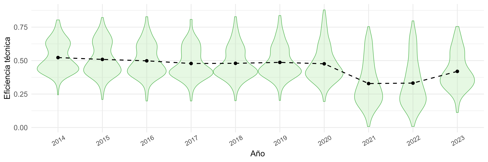
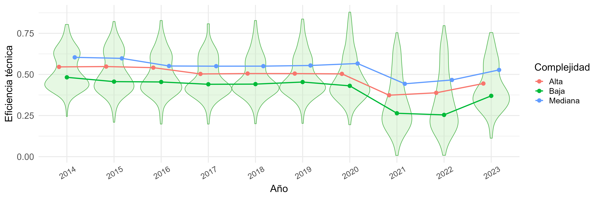
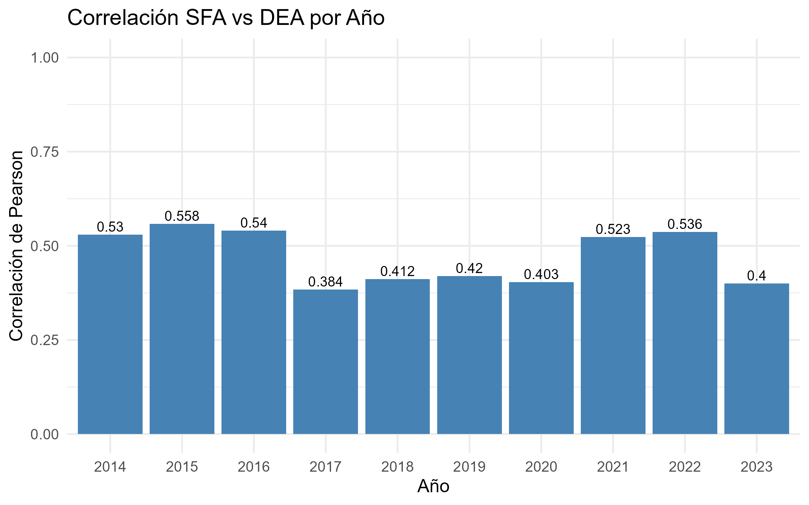
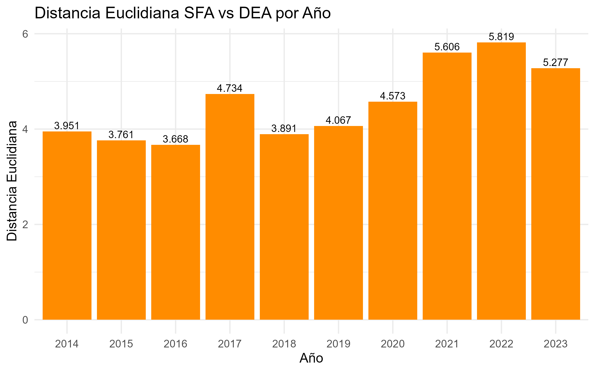

```{r setup, include=FALSE}
knitr::opts_chunk$set(echo = FALSE)
load("testing.RDATA")   # carga variables guardadas (datos_procesados, etc.)
library(dplyr)
library(ggplot2)
library(knitr)
```

# DISTRIBUCIONES DE EFICIENCIA TÉCNICA

```{r grafico-normalidad, fig.width=15, fig.height=10}
if (exists("tabla_resultados")) {
  print(tabla_resultados$grafico)
} else {
  cat("No se encontró el gráfico de normalidad en testing.RDATA")
}
```

```{r violin-img, echo=FALSE, out.width="100%"}

```

```{r violin-complejidad-img, echo=FALSE, out.width="100%"}

```


# MÉTRICAS DE EFICIENCIA TÉCNICA

```{r}
tabla_eficiencias <- lapply(names(datos_procesados), function(anio){
  data.frame(
    Año = anio,
    Promedio = round(mean(datos_procesados[[anio]]$eff_global, na.rm = TRUE),3),
    Mediana  = round(median(datos_procesados[[anio]]$eff_global, na.rm = TRUE),3),
    Min      = round(min(datos_procesados[[anio]]$eff_global, na.rm = TRUE),3),
    Max      = round(max(datos_procesados[[anio]]$eff_global, na.rm = TRUE),3)
  )
}) %>% bind_rows()

kable(tabla_eficiencias)


```


# TOP 10 HOSPITALES CON MAYOR MEDIA DE EFICIENCIA TÉCNICA

```{r top10-hospitales}
df_top10 <- do.call(rbind, datos_procesados) %>%
  group_by(IdEstablecimiento, `Nombre Establecimiento`, complejidad) %>%
  summarise(Media = round(mean(eff_global, na.rm = TRUE), 3), .groups = "drop") %>%
  arrange(desc(Media)) %>%
  head(10) %>%
  rename(
    ID = IdEstablecimiento,
    Nombre = `Nombre Establecimiento`,
    Complejidad = complejidad
  )

kable(df_top10)
```

# MAPAS DE EFICIENCIA TÉCNICA EN CHILE

```{r mapas-eficiencia, echo=FALSE, fig.align="center", out.width="100%"}
# Lista de archivos de mapas
mapas <- list.files(pattern = "Gráfica Chile - Eficiencia técnica_Año_.*\\.jpg$")

# Ordenar por año (opcional)
mapas <- sort(mapas)

# Mostrar todas las imágenes
knitr::include_graphics(mapas)
```
  
  
# OUTLIERS DE LA EFICIENCIA TÉCNICA

```{r outliers-grafico, fig.width=8, fig.height=5}
# Boxplot de eficiencia por año con outliers
datos_largos %>%
  ggplot(aes(x = factor(anio), y = eff_global)) +
  geom_boxplot(outlier.colour = "red", outlier.shape = 8) +
  labs(x = "Año", y = "Eficiencia técnica", title = "Outliers de eficiencia por año") +
  theme_minimal()
```


# PRINCIPALES DETERMINANTES DE LA EFICIENCIA TÉCNICA

```{r determinantes-graficos, echo=FALSE, fig.width=8, fig.height=5}

# Generar gráficos para cada año
graficos_determinantes <- lapply(names(random_forest), function(anio) {
  importancia <- random_forest[[anio]]$importancia
  df_imp <- data.frame(
    Variable = rownames(importancia),
    IncMSE = importancia[, 1]
  )
  df_imp <- df_imp[order(-df_imp$IncMSE), ][1:10, ]
  
  ggplot(df_imp, aes(x = reorder(Variable, IncMSE), y = IncMSE)) +
    geom_bar(stat = "identity", fill = "steelblue") +
    coord_flip() +
    labs(title = paste("DETERMINANTES -", anio),
         x = "Variable", y = "IncMSE") +
    theme_minimal(base_size = 14)
})

# Mostrar todos los gráficos uno tras otro
for (g in graficos_determinantes) {
  print(g)
}
```

# COMPARACIÓN SFA VS DEA

```{r correlacion-vs, echo=FALSE, out.width="100%"}

```

```{r distancia-vs, echo=FALSE, out.width="100%"}

```